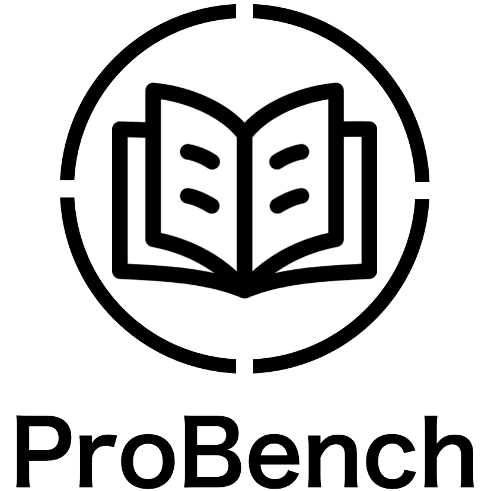
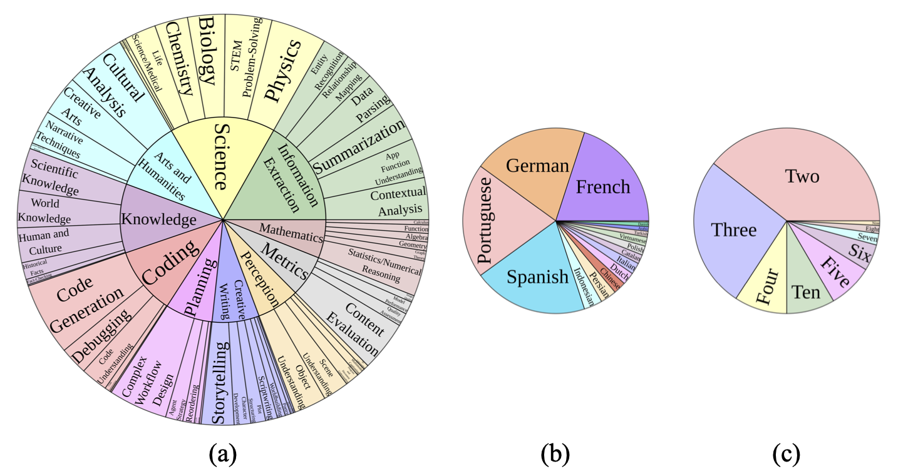
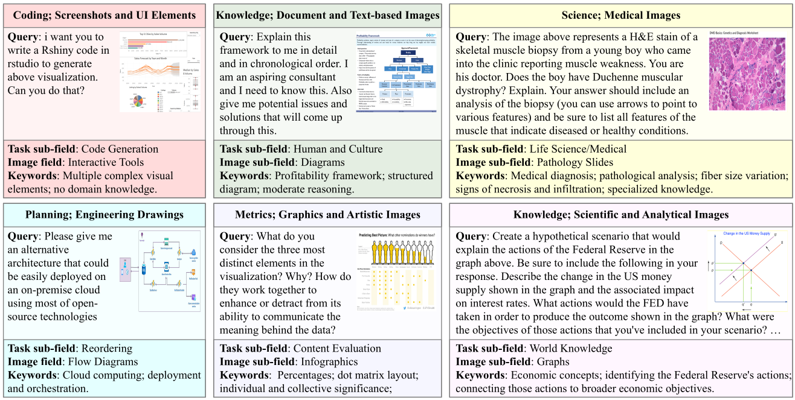

<div align="center">
  <h1>ProBench: Judging Multimodal Foundation Models on Open-ended Multi-domain Expert Tasks</h1> 
  
    
<div style="width: 35%; text-align: center; margin:auto;">
      
</div> 

  <div>
      <a href="https://scholar.google.com/citations?user=IF0xw34AAAAJ&hl" target="_blank">Yan Yang</a>
      <a href="https://scholar.google.com/citations?user=h5XtaUUAAAAJ" target="_blank">Dongxu Li</a>,
      <a href="https://scholar.google.com.hk/citations?user=wth-VbMAAAAJ" target="_blank">Haoning Wu</a>,
      <a href="https://scholar.google.com/citations?user=Po65v_MAAAAJ" target="_blank">Bei Chen</a>,
      <a href="https://scholar.google.com.au/citations?user=zUVtz6gAAAAJ&hl" target="_blank">Liu Liu</a>,
      <a href="https://scholar.google.com/citations?user=kAt6-AIAAAAJ&hl" target="_blank">Liyuan Pan</a>,
      <a href="https://scholar.google.com/citations?user=MuUhwi0AAAAJ" target="_blank">Junnan Li</a>
</div>


    
<div>
   <a href="https://huggingface.co/datasets/HelloKKMe/ProBench"><strong>Dataset on HuggingFace</strong></a>  | <a href="https://yan98.github.io/ProBench/"><strong>Homepage</strong></a> | <a href="https://yan98.github.io/ProBench/index.html#leaderboard"><strong> Leaderboard</strong></a> |  <a href="xxx"><strong>ArXiv</strong></a>
   </div>   
    
    
    
<h2>Introduction</h2> 
 Our ProBench spans 10 task fields and 56 sub-fields, supports 17 languages, and supports conversations with up to 13 conversation turns. 
<div style="width: 80%; text-align: center; margin:auto;">
      
</div> 

<h2>Example</h2> 
The ProBench highlights open-ended expert tasks. Here are examples:
<div style="width: 80%; text-align: center; margin:auto;">
      
</div> 


</div> 

## Install

Please install ProBench as follows:

```
git clone https://github.com/Yan98/ProBench_eval
cd ProBench_eval
pip install -e .
```

## [Custom Use] Evaluating on Probench

We encourage users to customizes the models in `gen_answer_vllm.py`. Here, we provided a sample class of `Pixtral-12B-2409` and `QwenQwen2-VL-7B-Instruct"`.

1. Generating MLLM outputs.

```shell
python3 gen_answer_vllm.py --model Pixtral-12B-2409 --save-name Pixtral 
```

2. Running judgements.

```shell
export base_url=??? # Configuring a gpt-4o judge.
export api_key=???
python3 gen_judgement.py --model Pixtral-12B-2409 --model-answer-file output/Pixtral.jsonl --judge_model gpt-4o-2024-08-06 --num_workers 64 
```

3. Show Results.
```shell
export base_url=??? # Configuring a gpt-4o judge.
export api_key=???
python3 show_result.py --model Pixtral-12B-2409--model-answer-file output/Pixtral.jsonl --judgement-file output/Pixtral --track singleround
python3 show_result.py --model Pixtral-12B-2409--model-answer-file output/Pixtral.jsonl --judgement-file output/Pixtral --track multi-round
python3 show_result.py --model Pixtral-12B-2409--model-answer-file output/Pixtral.jsonl --judgement-file output/Pixtral --track multi-linguistic
```
There are various settings, e.g., evaluating on specific chanllenge level, question type, image type. We encourage the user to explore.


## Contact

Please contact `yan.yang@anu.edu.au` for any queries.

## License

This dataset follows CC-BY-NC-SA 4.0 license. Please use this dataset for non-commercial use ONLY.

## Citation

```bibtex
@misc{tbc,
}
```